# 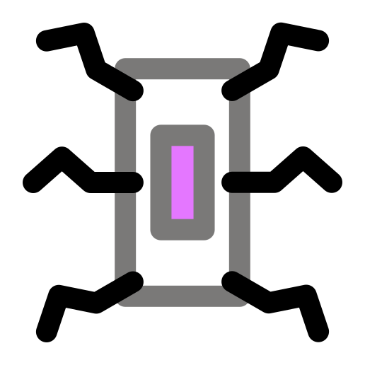 Hexapod

A Hexapod Robot using Raspberry Pi Zero W

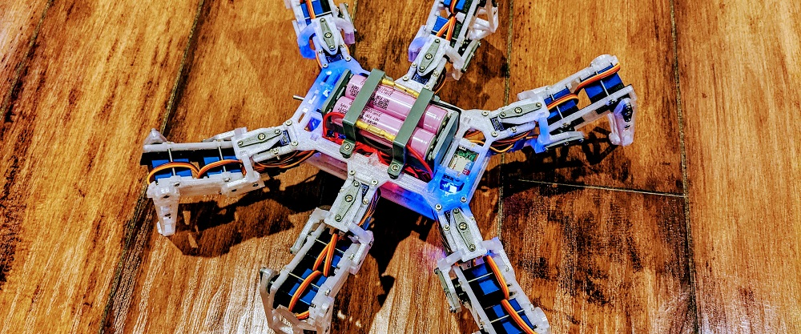

[](https://play.google.com/store/apps/details?id=com.rookiedev.hexapod)
[](https://github.com/rookiepeng/hexapod/releases)
[](https://github.com/rookiepeng/hexapod/releases)

## Introduction

This is a hexapod robot based on [Smallp Tsai](https://github.com/SmallpTsai)'s [hexapod-v2-7697](https://github.com/SmallpTsai/hexapod-v2-7697) project.
This project reused most of the mechanical design in the original project, but with a full redesign of the circuits and software.
The table below shows the difference between this project and the original one.

|                 | Original hexapod-v2-7697 | This project                                    |
| --------------- | ------------------------ | ----------------------------------------------- |
| Controller      | Linkit 7697              | Raspberry Pi Zero W or Raspberry Pi Zero W 2    |
| PWM control     | Custom circuit board     | 2 x PCA9685 motor driver boards                 |
| DC-DC           | 7 x mini360 modules      | 2 x XL4005 5A Max DC-DC modules and 1 x mini360 |
| Power           | 2S Lipo battery          | 2 x 18650 batteries                             |
| Remote          | BLE                      | WiFi, Bluetooth                                 |
| Remote software | Android and iOS          | PC, Android                                     |

https://user-images.githubusercontent.com/471808/148647807-02e3e901-6181-4473-8ac4-3b5998fa8d17.mp4

## Software

### Raspberry Pi

#### Requirements

Raspberry Pi is running [`Raspberry Pi OS`](https://www.raspberrypi.com/software/).

- Enable `I2C` through `raspi-config`

``` bash
sudo raspi-config
```

- Install required packages

``` bash
sudo apt-get install python3-numpy python3-pip
```

- Install required Python modules

``` bash
pip3 install adafruit-circuitpython-servokit
```

> Tips: It is convenient to debug code on Raspberry Pi through VSCode's remote feature.

#### Running

The hexapod program, located under `./software/raspberry pi/`, is written in Python. Use the following command to start it manually.

``` bash
python3 hexapod.py
```

### Android

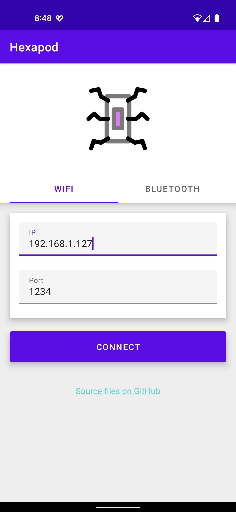 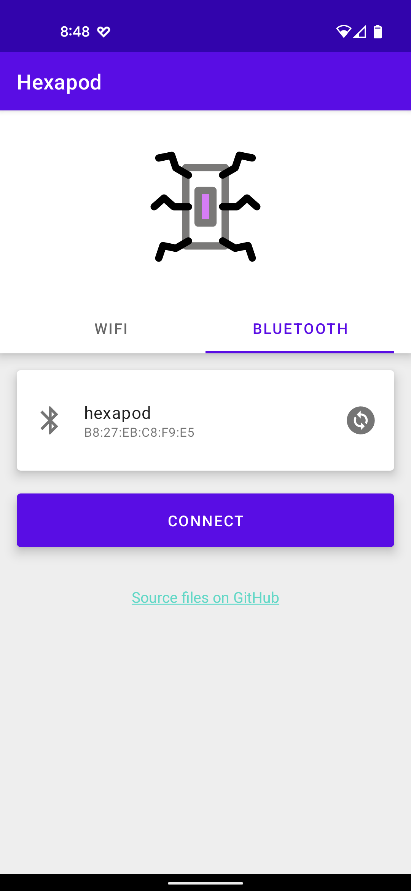

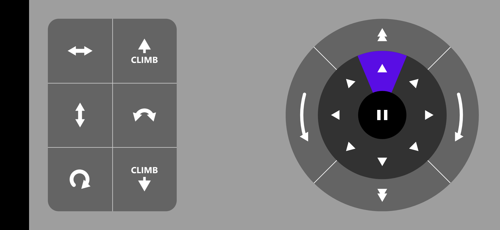

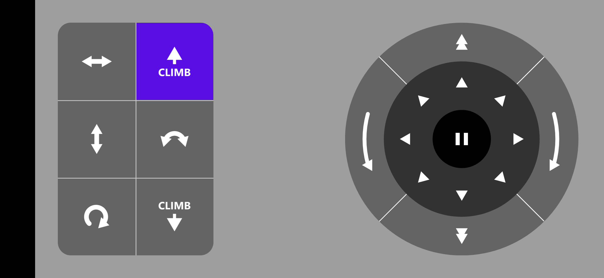

### PC

PC program source files are located under `./software/pc/`. The compiled program can be downloaded under the [release](https://github.com/rookiepeng/hexapod/releases) page.

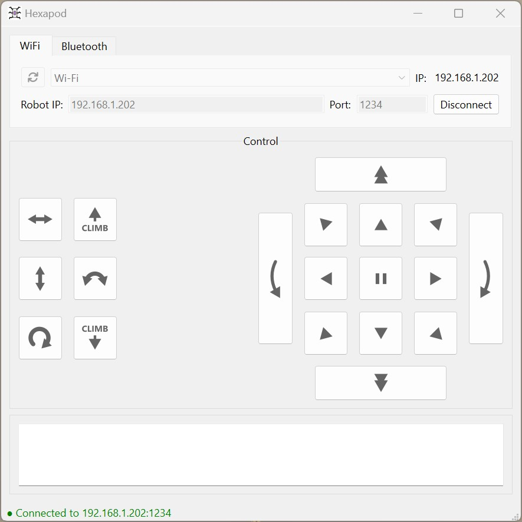

- Find the correct IP address of the Raspberry Pi on the hexapod
- Connect to the hexapod using the IP address
- Use the buttons on the panel to control the hexapod

## Mechanism

### Bill of Materials (BOM)

#### Servos

18 TowerPro [MG92B](http://www.towerpro.com.tw/product/mg92b/) are required.

> The dimension of 3d printed part is highly dependent on the servo's size. Modification is required if you want to use alternative servos.

#### 3D-Printed Parts

##### Body x 1

| Filename       | Thumbnail                                                               | Required |
| -------------- | ----------------------------------------------------------------------- | -------- |
| body_top       |              | 1        |
| body_bottom    |        | 1        |
| body_side_wall | 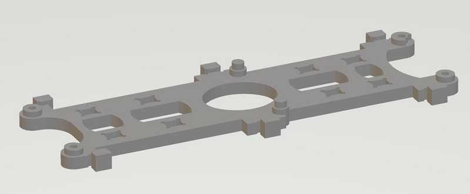 | 2        |
| body_back_wall |  | 1        |
| battery_box    | 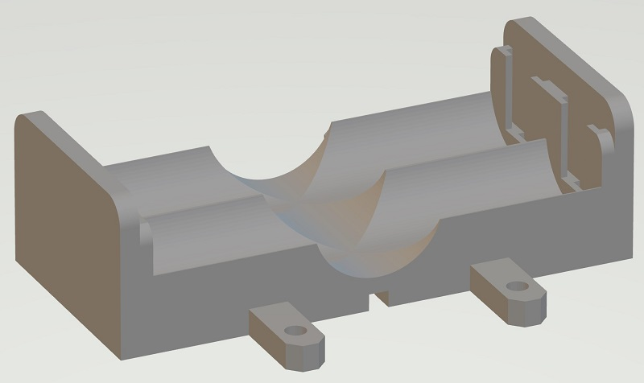       | 1        |
| battery_holder |  | 2        |

##### Leg x 6

| Filename        | Thumbnail                                                                 | Required |
| --------------- | ------------------------------------------------------------------------- | -------- |
| thigh_top       |              | 1 (x6)   |
| thigh_bottom    | 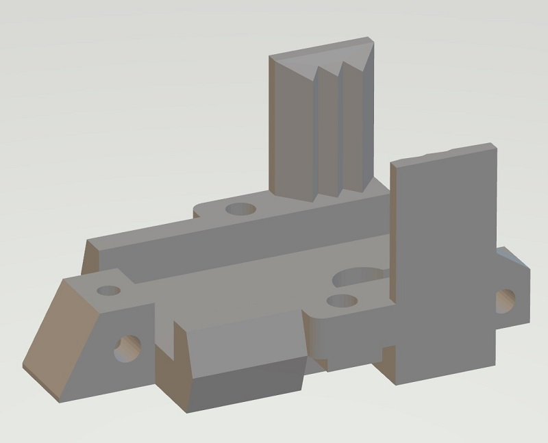       | 1 (x6)   |
| joint_cross     |          | 1 (x6)   |
| joint_top       | 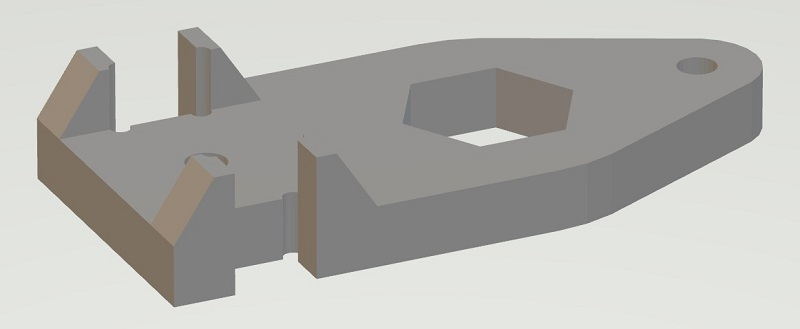             | 2 (x6)   |
| joint_bottom    | 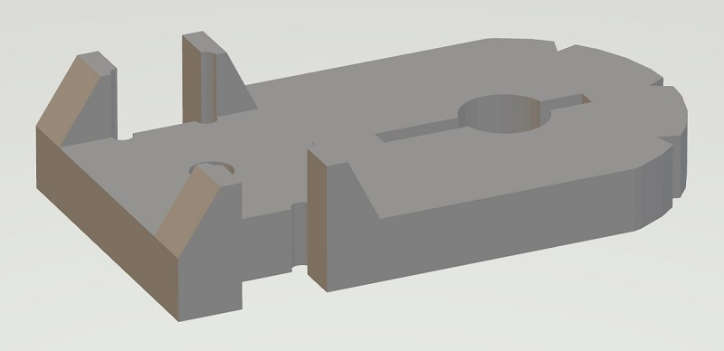       | 2 (x6)   |
| leg_top         |                  | 1 (x6)   |
| let_bottom      |            | 1 (x6)   |
| foot_top        | 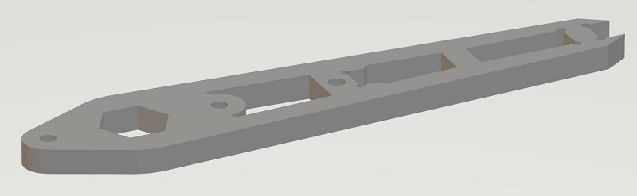               | 1 (x6)   |
| foot_bottom     |          | 1 (x6)   |
| foot_ground     | 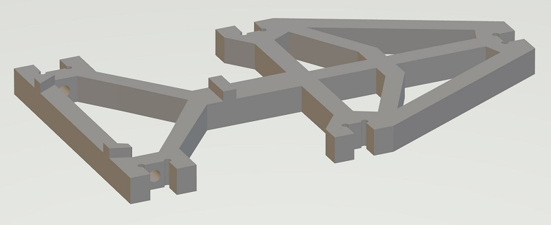         | 1 (x6)   |
| foot_tip        | 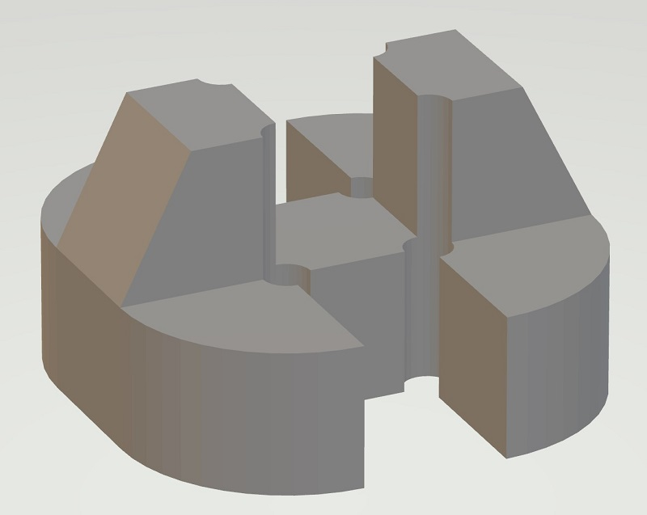               | 1 (x6)   |
| servo_horn_j1j2 | 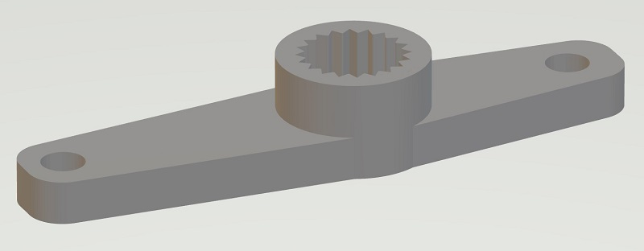 | 2 (x6)   |
| servo_horn_j3   | 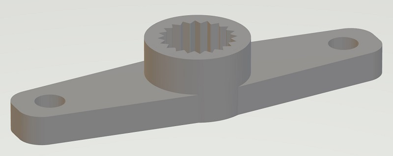     | 1 (x6)   |

#### Others

| Name      | Spec    | Thumbnail                    | Required | Note                                              |
| --------- | ------- | ---------------------------- | -------- | ------------------------------------------------- |
| Screw     | M2 6mm  |      | 54       | Servo Arm: 1 x 18<br>Joint: 4 x 6<br>Thigh: 2 x 6 |
| Screw     | M2 10mm |    | 24       | Thigh: 1 x 6<br>Pin lock: 1 x 18                  |
| Screw     | M2 30mm |    | 36       | Servo: 2 x 18                                     |
| Nuts      | M2      |      | 36       | Servo: 2 x 18                                     |
| Pin (304) | M4 6mm  |  | 18       | Servo: 1 x 18                                     |

### Leg Assemble

#### Assembly video

<a href='https://youtu.be/oaAE5fC09KQ'></a>

#### Exploded view


#### Detailed steps

- **Step 1** - Combine `thigh_top`, `MG92B` and `thigh_bottom`, use M2x30mm screw and nut to secure them together.


- **Step 2** - Grab one `joint_cross`, `joint_top` and `joint_bottom` and combine them


- **Step 3** - First put 2 x `MG92B`, `leg_top` and `leg_bottom` together with M2x30mm screw and nut. Then attach `joint_top` and `joint_bottom` altogether


- **Step 4** - Grab `foot_top`, `foot_bottom` and `foot_ground` (and `foot_top`) and assemble them.


- **Finish** - Great, you got 1 leg done, 5 more to go :)


## Electronics

### Bill of Materials (BOM)

| Name                       | Thumbnail                                                              | Required |
| -------------------------- | ---------------------------------------------------------------------- | -------- |
| Raspberry Pi Zero W or W 2 |  | 1        |
| PCA9685 motor driver       |               | 2        |
| XL4005 DC-DC step down     |                 | 2        |
| Mini 360 DC-DC step down   |               | 1        |
| Toggle switch              | 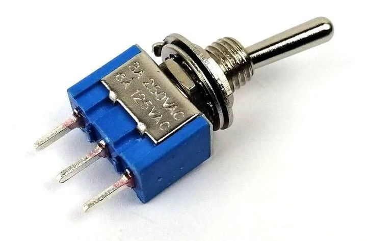  | 1        |

### Connection Diagram

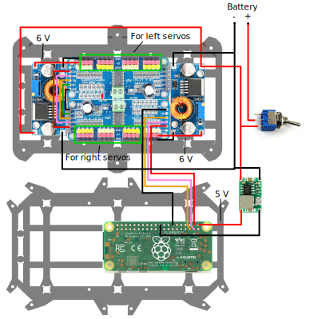

