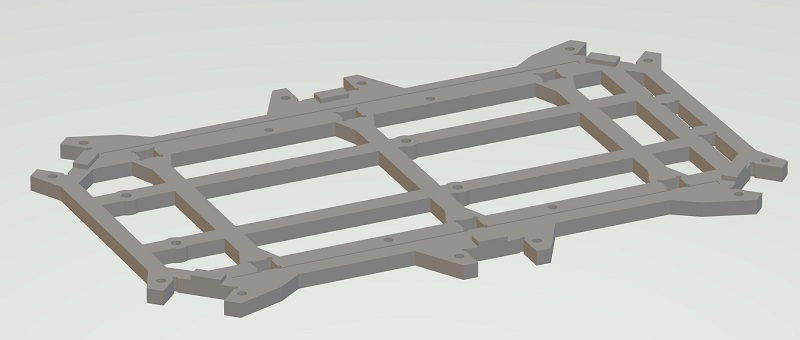
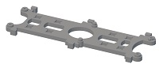
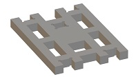
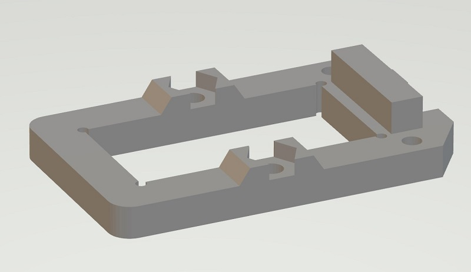
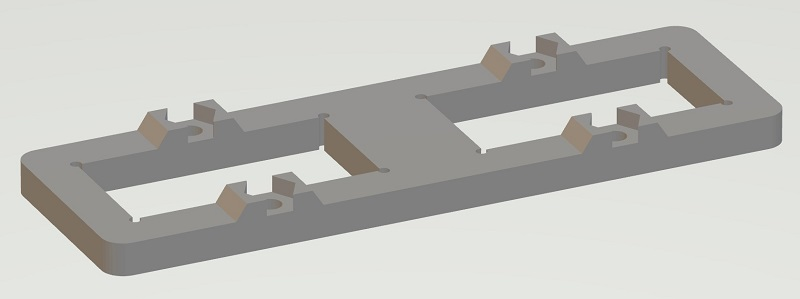
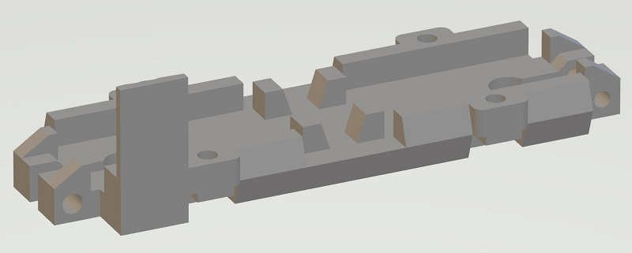
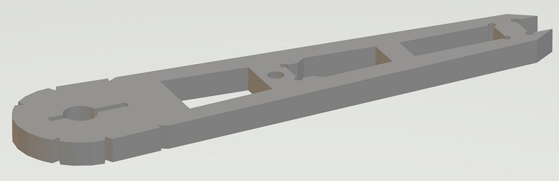

# Mechanism

## Bill of Materials

### Servos

18 TowerPro [MG92B](http://www.towerpro.com.tw/product/mg92b/) are required.

> The dimension of 3d printed part is highly dependent on the servo's size. Modification is required if you want to use alternative servos.

### 3D-Printed Parts

#### Body x 1

| Filename       | Thumbnail                                                          | Required |
| -------------- | ------------------------------------------------------------------ | -------- |
| body_top       |        | 1        |
| body_bottom    |     | 1        |
| body_side_wall |  | 2        |
| body_back_wall |  | 1        |

#### Leg x 6

| Filename     | Thumbnail                                                           | Required |
| ------------ | ------------------------------------------------------------------- | -------- |
| thigh_top    |        | 1 (x6)   |
| thigh_bottom |  | 1 (x6)   |
| joint_cross  |    | 1 (x6)   |
| joint_top    |        | 2 (x6)   |
| joint_bottom |  | 2 (x6)   |
| leg_top      |            | 1 (x6)   |
| let_bottom   |      | 1 (x6)   |
| foot_top     |          | 1 (x6)   |
| foot_bottom  |    | 1 (x6)   |
| foot_ground  |    | 1 (x6)   |
| foot_tip     |          | 1 (x6)   |

### Others

| Name      | Spec    | Thumbnail                    | Required | Note                                              |
| --------- | ------- | ---------------------------- | -------- | ------------------------------------------------- |
| Screw     | M2 6mm  |      | 54       | Servo Arm: 1 x 18 Joint: 4 x 6 Thigh: 2 x 6 |
| Screw     | M2 10mm |    | 24       | Thigh: 1 x 6 Pin lock: 1 x 18                  |
| Screw     | M2 30mm |    | 36       | Servo: 2 x 18                                     |
| Nuts      | M2      |      | 36       | Servo: 2 x 18                                     |
| Pin (304) | M4 6mm  |  | 18       | Servo: 1 x 18                                     |

## Leg Assemble

### Step 1

Combine `thigh_top`, `MG92B` and `thigh_bottom`, use M2x30mm screw and nut to secure them together.

### Step 2

Grab one `joint_cross`, `joint_top` and `joint_bottom` and combine them

### Step 3

First put 2 x `MG92B`, `leg_top` and `leg_bottom` together with M2x30mm screw and nut.
Then attach `joint_top` and `joint_bottom` altogether

### Step 4

Grab `foot_top`, `foot_bottom` and `foot_ground` (and `foot_top`) and assemble them.

### Finish!

Great, you got 1 leg done, 5 more to go :)

Leg assembly instruction video https://youtu.be/oaAE5fC09KQ is also available.

> Note. Total 6 Legs are required.
